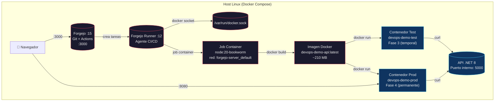

# 🚀 Resumen Visual del Pipeline CI/CD — DevOps & Sistemas Distribuidos

> **Exposición académica** • Forgejo + Forgejo Actions + .NET 8 + Docker
> Pipeline de 4 fases: `TDD → Docker Build → Pruebas HTTP → Deploy`

---

## 📋 Arquitectura General del Proyecto



---

## 🔄 Pipeline CI/CD — Diagrama de Flujo

```mermaid
flowchart LR
    PUSH["git push"] -->|trigger| F1
    
    subgraph F1["🔬 Fase 1: TDD"]
        direction TB
        C1["actions/checkout@v4"] --> SDK["actions/setup-dotnet@v4"] --> R1["dotnet restore"] --> B["dotnet build"] --> T["dotnet test"]
        T -->|15/15 ✅| OK1["✔ Éxito"]
        T -->|❌| FAIL1["✘ Pipeline Detenido"]
    end
    
    OK1 --> F2
    
    subgraph F2["🐳 Fase 2: Docker Build"]
        direction TB
        C2["actions/checkout@v4"] --> DC["apt-get install docker.io"] --> DB["docker build -t devops-demo-api ."]
        DB -->|Build OK ✅| OK2["✔ Éxito"]
        DB -->|❌| FAIL2["✘ Pipeline Detenido"]
    end
    
    OK2 --> F3
    
    subgraph F3["🌐 Fase 3: Pruebas HTTP"]
        direction TB
        C3["actions/checkout@v4"] --> DC2["Instalar Docker CLI"] --> DRUN["docker run -d<br/>--network=forgejo-server_default"] --> CURL["7 pruebas con curl"]
        CURL -->|7/7 ✅| OK3["✔ Éxito"]
        CURL -->|❌| FAIL3["✘ Pipeline Detenido"]
    end
    
    OK3 --> F4
    
    subgraph F4["🚀 Fase 4: Deploy"]
        direction TB
        STOP["docker stop/rm devops-demo-prod"] --> DEPLOY["docker run -d<br/>-p 8080:5000<br/>--network=forgejo-server_default"] --> VERIFY["curl health check"]
        VERIFY -->|✅| OK4["✔ Éxito"]
        VERIFY -->|❌| FAIL4["✘ Rollback manual"]
    end
    
    OK4 --> DONE["✅ PIPELINE COMPLETADO<br/>http://localhost:8080"]
    
    classDef phase fill:#2d3748,stroke:#4a5568,color:#e2e8f0
    classDef success fill:#22543d,stroke:#48bb78,color:#e2e8f0
    classDef fail fill:#742a2a,stroke:#fc8181,color:#e2e8f0
    classDef final fill:#2b6cb0,stroke:#63b3ed,color:#e2e8f0
    
    class F1,F2,F3,F4 phase
    class OK1,OK2,OK3,OK4 success
    class FAIL1,FAIL2,FAIL3,FAIL4 fail
    class DONE final
```



---

## ⏱️ Tiempos del Pipeline

```mermaid
gantt
    title Duración típica del pipeline (~6 min total)
    dateFormat  X
    axisFormat %S s
    
    section Fase 1: TDD
    Checkout + Setup .NET SDK  :a1, 0, 45s
    dotnet restore + build     :a2, after a1, 45s
    dotnet test (15 tests)     :a3, after a2, 30s
    
    section Fase 2: Docker Build
    Checkout + Install Docker  :b1, 0, 30s
    docker build multi-stage   :b2, after b1, 60s
    
    section Fase 3: HTTP Tests
    Checkout + Install Docker  :c1, 0, 30s
    docker run + wait health   :c2, after c1, 20s
    7 pruebas curl             :c3, after c2, 20s
    cleanup                    :c4, after c3, 10s
    
    section Fase 4: Deploy
    Install Docker             :d1, 0, 30s
    docker stop/rm + run       :d2, after d1, 15s
    health check verification  :d3, after d2, 15s
```



---

## 🐛 La Travesía de Depuración (Runs 1 → 18)

```mermaid
timeline
    title 18 ejecuciones del pipeline hasta el éxito
    section Runs 1-5 : Problemas iniciales
      1-3 : Sintaxis YAML, checkout sin token, `gitea.*` vs `github.*`
      4-5 : Labels runner no coinciden, `actions/upload-artifact` incompatible
    section Runs 6-10 : Depuración de Fases 1-2
      6-7 : Fase 1 ✅ pasa. Fase 2 falla: docker no instalado, paths incorrectos
      8-9 : Fase 1 ✅✅. Fase 2 ✅. Fase 3 falla: Playwright no disponible
      10  : Playwright CLI v1.2.3 no soporta `playwright install`
    section Runs 11-15 : Playwright → HTTP
      11  : `npx playwright` funciona pero descarga Chromium cada run
      12  : Fase 3 falla: `unable to find user appuser` en Dockerfile
      13  : appuser corregido. Falla: red no compartida (localhost inaccesible)
      14-15 : Red corregida. Falla: endpoints API erróneos (`/api/users`)
    section Runs 16-18 : Towards success
      16  : ✅ Fase 1-3 pasan. Fase 4 falla: puerto 80 ocupado
      17  : ✅ Fase 1-3 pasan. Fase 4 falla: puerto 80 (de nuevo)
      18  : ✅✅✅✅ **TODAS LAS FASES PASAN** 🎉
```

---

## 🛠️ Configuración Final (Archivos Clave)

### `docker-compose.yml` — Sin DIND, socket Docker directo

```yaml
services:
  forgejo:
    image: codeberg.org/forgejo/forgejo:15
    ports: ["3000:3000", "2222:22"]
    environment: [FORGEJO__actions__ENABLED=true]

  forgejo-runner:
    image: data.forgejo.org/forgejo/runner:12
    environment: [DOCKER_HOST=unix:///var/run/docker.sock]
    volumes:
      - ./runner-config:/data
      - /var/run/docker.sock:/var/run/docker.sock   # ← clave
    command: "forgejo-runner daemon --config /data/config.yaml"
```

### `runner-config/config.yaml` — Red compartida + Docker automount

```yaml
container:
  network: "forgejo-server_default"   # ← Jobs acceden apps por nombre
  docker_host: "automount"             # ← Socket Docker automático
  valid_volumes: ['**']
```

### `Dockerfile` — Multi-etapa con usuario no-root

```dockerfile
FROM mcr.microsoft.com/dotnet/sdk:8.0 AS build    # SDK para compilar
FROM build AS test                                  # Etapa de test
FROM mcr.microsoft.com/dotnet/aspnet:8.0            # Runtime final (~210 MB)
RUN adduser --disabled-password appuser && \
    chown -R appuser:appuser /app
USER appuser                                       # ← Seguridad
```

### Variables de Forgejo Actions (`github.*`)

| Variable | Equivalente GitHub | Uso en nuestro pipeline |
|----------|-------------------|------------------------|
| `github.sha` | SHA del commit | Tag de imagen Docker |
| `github.actor` | Usuario que pusheó | Run name |
| `github.ref` | Referencia completa | Run name |
| `github.ref_name` | Nombre de branch | Condición de deploy |

---

## ✅ Demo en Vivo — Pasos

```bash
# 1. VER el pipeline corriendo
#    Forgejo UI → super/devops-lab → Actions
#    (el último push ya disparó el pipeline)

# 2. MONITOREAR cada fase en tiempo real
#    - Fase 1: dotnet test (15 tests)
#    - Fase 2: docker build multi-etapa
#    - Fase 3: 7 pruebas curl
#    - Fase 4: docker run -p 8080:5000

# 3. VERIFICAR la app en producción
curl http://localhost:8080/health
# → {"status":"healthy","timestamp":"...","uptime":...}

curl http://localhost:8080/api/tasks
# → [{"id":2,"title":"Configurar Forgejo",...}, ...]

# 4. VER el pipeline histórico
#    Forgejo UI → Actions → pestaña "Runs"
#    Mostrar Run #18 (success) vs runs anteriores

# 5. (Opcional) SIMULAR un error
git commit --allow-empty -m "test: romper pipeline intencional"
git push
# Mostrar cómo Fase 1 detecta el error y detiene el pipeline
```

---

## 📊 Resumen de Tecnologías

| Tecnología | Versión | Rol |
|------------|---------|-----|
| Forgejo | 15 | Servidor Git + CI/CD nativo |
| Forgejo Runner | 12 | Agente que ejecuta jobs |
| .NET SDK | 8.0 | Compilación y tests |
| xUnit + Moq | — | Testing TDD (15 tests) |
| Docker | socket host | Build + Run contenedores |
| curl + python3 | — | Pruebas de integración HTTP |
| Mermaid | — | Diagramas de este documento |

---

## 📁 Archivos del Proyecto

```
Exposicion/
├── 01-fundamentos-devops-cicd.md          # Investigación teoría DevOps
├── 02-piramide-testing-concurrente.md     # Pirámide de testing concurrente
├── 03-guia-instalacion-forgejo.md         # Guía instalación Forgejo + Runner
├── 04-guia-pipeline-forgejo.md            # Guía pipeline CI/CD
├── resumen-exposicion.md                  # ← Este documento
├── dotnet-app/
│   ├── .forgejo/workflows/ci-cd.yml       # Pipeline YAML (4 fases)
│   ├── Dockerfile                         # Multi-etapa .NET 8
│   ├── MinimalWebApi.sln
│   ├── src/Program.cs                     # API REST (10 endpoints)
│   └── tests/UnitTests/                   # 15 tests TDD
└── forgejo-server/
    ├── docker-compose.yml                 # Forgejo + Runner (sin DIND)
    └── runner-config/config.yaml          # Config del runner
```

---

> **Pipeline CI/CD completamente funcional** — 4 fases, 6 minutos, 100% local con Docker Compose y Forgejo Actions.
